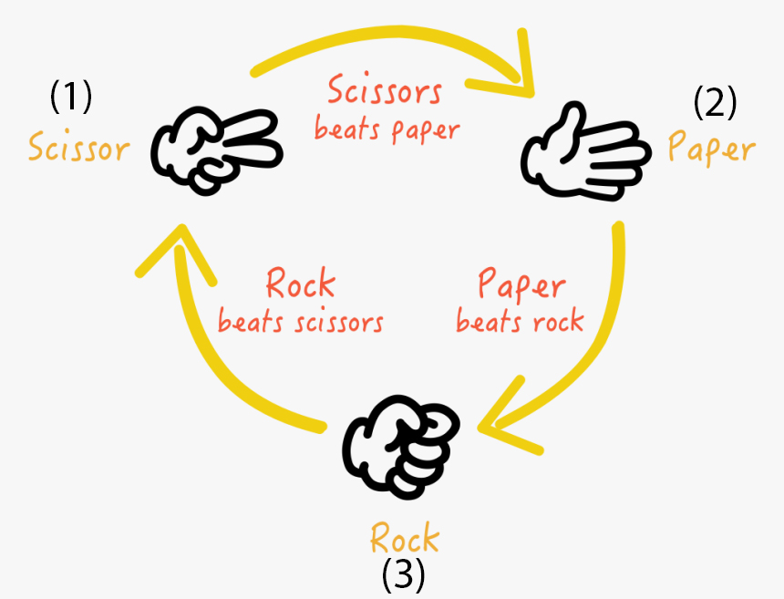
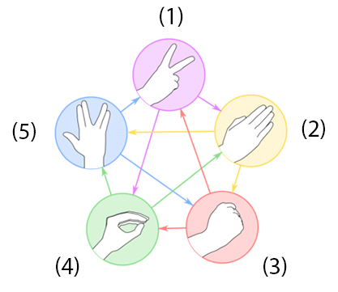

# Rock Paper Scissors Game
*Classic game with extandable set of movements.*
See it live [here](https://amorkor.github.io/Rock-Paper-Scissors/)

Universal algorithm make it easy to create infinite amount of game variations.
To add move option you need to insert it between two existed ones. Previous must beat new option, while next must be beaten by new.

**_So far adding new options is possible only by writing them down in data file_**

### Algorithm description
Each game option has its own coefficient defined by position in data file. Position in turn is dictated by game rules. Image below illustrates this idea:

To define winner algorithm compares coefficients. 
1. If they differ by 1, that is they stay nearby on the circle, wins higher. For example, scissors (1) beats paper (2).

*But if they differ by more than 1:*

2. Algorithms determines whether difference is even or odd.
3. If difference is even, wins higher coefficient.
4. If difference is even, wins lower.

To clearly get the point look at the picture:

Scissors (1) beats paper (2). That's ok, difference between them is 1. At the same time rock (3) beats scissors (1), because they differ by 2, which is even. But what about lizard (4) and scissors? They differ by 3, which is odd. In this case lower value (1, belong to scissors) beats higher (4, belong to lizard).

This scheme allows you to insert whatever options you want, all you need is define where this option on the circle will be. 

**_Infinite Rock Paper Scissors game!_**